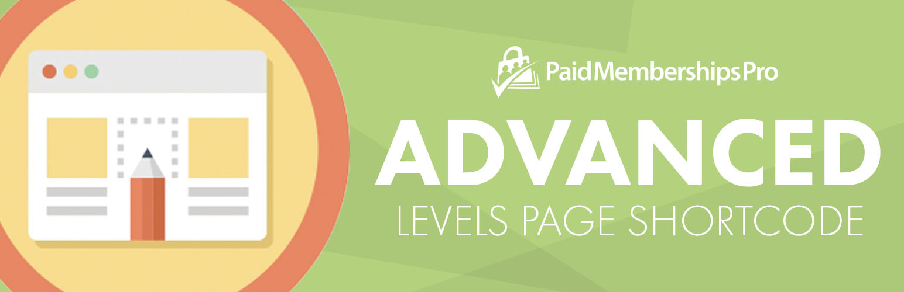

# [Paid Memberships Pro - Advanced Levels Page Shortcode](https://www.paidmembershipspro.com/add-ons/pmpro-advanced-levels-shortcode/) #
[comment]: # (Generate badges from shields.io, only works for .org plugins to get other stats etc. We'd have to create our own endpoints for Premium plugins)

### Welcome to the Paid Memberships Pro - Advanced Levels Page Shortcode GitHub Repository

This plugin activates a new shortcode with many attributes to customize the levels page or to display level offerings and pricing tables anywhere on your membership site. The shortcode also includes support for widely used theme frameworks/parent themes.

Here is an example of the enhanced shortcode this Add On includes:

`[pmpro_advanced_levels levels="1,3,2" layout="3col" description="true" checkout_button="Sign Me Up!" price="full"]`

For more information please visit [the Add On documentation page for this plugin](https://www.paidmembershipspro.com/add-ons/pmpro-advanced-levels-shortcode/).

## Installation ##
For detailed installation steps, visit the [documentation](https://www.paidmembershipspro.com/add-ons/pmpro-advanced-levels-shortcode/) page.

1. Download the current development ZIP file directly: `https://github.com/strangerstudios/pmpro-advanced-levels-shortcode/archive/dev.zip`

**Please ensure that once installing this version of the plugin to remove `-dev` from the plugin's folder name.**

## Bugs ##
If you find an issue/bug, let us know by [creating a detailed GitHub issue](https://github.com/strangerstudios/pmpro-advanced-levels-shortcode/issues/new/choose).

## Support ##
This is a developer's portal for Paid Memberships Pro - Advanced Levels Page Shortcode. We do not offer support on this channel. **Any support related questions should be directed to [our website](https://www.paidmembershipspro.com/add-ons/pmpro-advanced-levels-shortcode/).**

## Contributing to Paid Memberships Pro - Advanced Levels Page Shortcode ##
We encourage and welcome any contribution to Paid Memberships Pro - Advanced Levels Page Shortcode. Please read the [guidelines for contributing](https://github.com/strangerstudios/pmpro-advanced-levels-shortcode/blob/dev/.github/CONTRIBUTING.md) to this repository.

There are various **ways to the help development** of Paid Memberships Pro - Advanced Levels Page Shortcode:

1. Report [bugs/issues](https://github.com/strangerstudios/pmpro-advanced-levels-shortcode/issues/new/choose) on GitHub.
2. Work on any issues by submitting a Pull Request.

Here are some ways for **non-developers to contribute** to Paid Memberships Pro - Advanced Levels Page Shortcode:

1. Translate Paid Memberships Pro - Advanced Levels Page Shortcode into your own [language](https://www.paidmembershipspro.com/paid-memberships-pro-in-your-language/).
2. [Purchase a Plus membership](https://paidmembershipspro.com/pricing) to help fund ongoing development and bug fixes.
